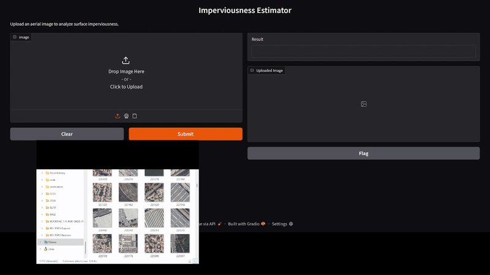

# Fine-tuning ResNet18 for Imperviousness Prediction

## 🎥 Demo


---

## 📌 Introduction
Urbanization often leads to the replacement of natural surfaces with impervious ones such as concrete, asphalt, and rooftops.  
Monitoring soil imperviousness is important because it directly impacts **water infiltration, flood risks, urban heat islands, and ecosystem health**.  
Accurate imperviousness mapping supports **sustainable urban planning, climate adaptation, and environmental monitoring**.

Traditionally, imperviousness is estimated using **satellite imagery** (e.g., Sentinel, Landsat).  
However, this approach can be complex and requires multi-source data processing.  
This project explores whether **orthophotos alone** (a widely available and high-resolution data source) can be sufficient for predicting imperviousness, potentially providing a **simpler and more accessible alternative**.

---

## 📌 Project Description
The goal of this project is to predict the **imperviousness level** of a **100 m x 100 m** area from orthophotos.  
To achieve this, a pre-trained **ResNet-18** model was fine-tuned for regression.  

- **Input**: orthophotos from the **IGN BD ORTHO** dataset  
- **Output**: imperviousness values derived from the **Copernicus Imperviousness Layer**  

---

## 🗂 Data
- **BD ORTHO**: high-resolution orthophotography provided by IGN  
- **Copernicus Imperviousness Layer**: European land imperviousness maps  

⚠️ Raw data is large and not included in this repository.  

---

## ⚙️ Installation
Clone the repository and install the dependencies:

```bash
git clone https://github.com/Nabham92/Imperviousness_predictor.git
cd Fine_tune_imperviousness_predictor
pip install -r requirements.txt

